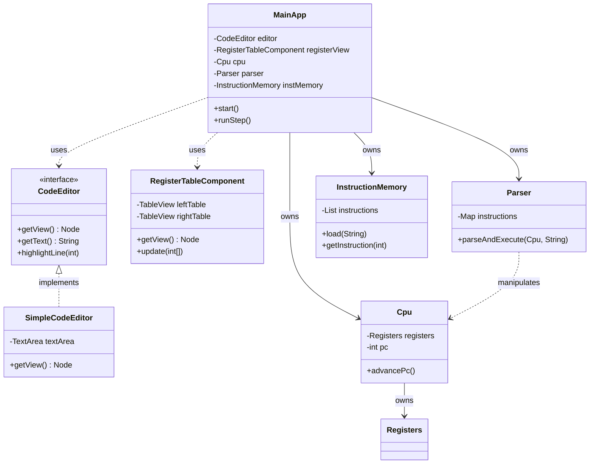

```mermaid
classDiagram
class MainApp {
-CodeEditor editor
-RegisterTableComponent registerView
-Cpu cpu
-Parser parser
-InstructionMemory instMemory
+start()
+runStep()
}

    class CodeEditor {
        <<interface>>
        +getView() Node
        +getText() String
        +highlightLine(int)
    }

    class SimpleCodeEditor {
        -TextArea textArea
        +getView() Node
    }

    class RegisterTableComponent {
        -TableView leftTable
        -TableView rightTable
        +getView() Node
        +update(int[])
    }

    class Parser {
        -Map instructions
        +parseAndExecute(Cpu, String)
    }

    class Cpu {
        -Registers registers
        -int pc
        +advancePc()
    }

    class InstructionMemory {
        -List instructions
        +load(String)
        +getInstruction(int)
    }

    MainApp ..> CodeEditor : uses
    MainApp ..> RegisterTableComponent : uses
    MainApp --> Cpu : owns
    MainApp --> Parser : owns
    MainApp --> InstructionMemory : owns
    CodeEditor <|.. SimpleCodeEditor : implements
    Parser ..> Cpu : manipulates
    Cpu --> Registers : owns
```